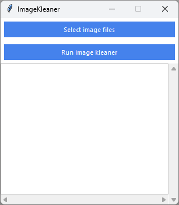

# ImageKleaner

When you take a picture, you capture more than just an image. Smartphones and digital cameras embed additional data within the picture file, known as EXIF metadata. This metadata includes information such as:

- Make and model of the device used to take the photo
- Dimensions and pixel density of the photo
- Camera settings (zoom, aperture, flash, etc.)
- Date, time, and location where the photo was taken
- Orientation of the device
- Altitude and speed of the photographer
- Copyright information

However, this metadata can pose privacy and security risks. This simple tool can be used to remove any EXIF metadata from png, jpg and jpeg images.

# Installation


1. Clone the repository:

   ```bash
   git clone https://github.com/TechWhizKid/ImageKleaner.git
   ```

2. Install the required dependencies using pip:

   ```bash
   cd ImageKleaner && pip install -r requrements.txt
   ```

3. Run the application:

   - _For Windows CMD / PowerShell_

   ```bash
   ImageKleaner.py
   ```

   - _For Linux / MacOS_

   ```
   python3 ImageKleaner.py
   ```

---

## ScreenShot

<div align="center">



</dviv>

---
