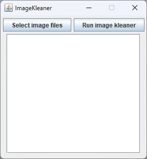

# ImageKleaner

When you take a picture, you capture more than just an image. Smartphones and digital cameras embed additional data within the picture file, known as EXIF metadata. This metadata includes information such as:

- Make and model of the device used to take the photo
- Dimensions and pixel density of the photo
- Camera settings (zoom, aperture, flash, etc.)
- Date, time, and location where the photo was taken
- Orientation of the device
- Altitude and speed of the photographer
- Copyright information

However, this metadata can pose privacy and security risks. This simple tool can be used to remove any EXIF metadata from png, jpg and jpeg images.

# Installation


**Download the latest binary release from [here](https://github.com/TechWhizKid/ImageKleaner/releases/) or follow the steps bellow:**

1. **Clone the repository:**

   ```bash
   git clone https://github.com/TechWhizKid/ImageKleaner.git
   ```

2. **For Python** - **Install the required dependencies using pip:**

   - _**For Windows CMD / PowerShell**_

   ```bash
   cd ImageKleaner && pip install -r requirements.txt
   ```

   - _**For Linux / MacOS**_

   ```bash
   cd ImageKleaner && pip3 install -r requirements.txt
   ```

3. **Run the application:**

   - _**For Python:**_

     - _**For Windows CMD / PowerShell**_

     ```bash
     ImageKleaner.py
     ```

     - _**For Linux / MacOS**_

     ```
     python3 ImageKleaner.py
     ```

   - _**For Java:**_

     ```
     java ImageKleaner.java
     ```

---

## ScreenShot

<div align="center">




</div>

---
